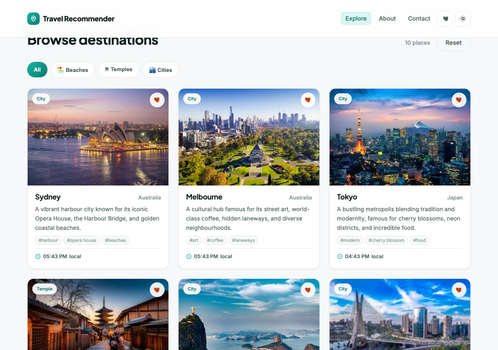
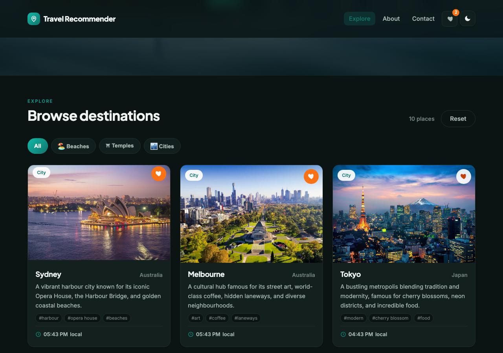
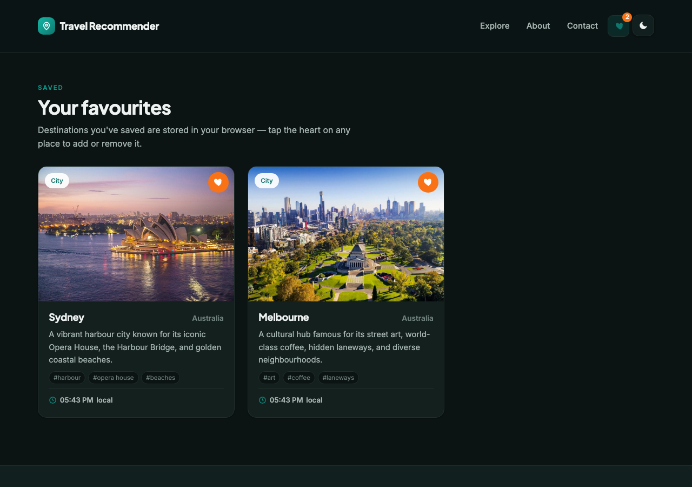

# Travel Recommender

A responsive travel-discovery site — search destinations, filter by category, see each place's **current local time**, save favourites, and switch between light and dark themes. Built with **vanilla HTML, CSS and JavaScript** (no framework). Started as a Coursera / IBM front-end capstone and rebuilt into a polished, feature-complete demo.

**🔗 Live demo: [faisal-almugesib.github.io/CourseraFinalProject](https://faisal-almugesib.github.io/CourseraFinalProject/)**


## Features

- **Live free-text search** — match any destination by name, country, category, tag, or description (the original only matched the exact words "beach/temple/country")
- **Category filters** — All / Beaches / Temples / Cities, as toggle chips
- **Current local time** per destination, via `Intl.DateTimeFormat` with each place's IANA time zone — refreshed automatically, no API needed
- **Favourites** — save places with the heart button; they persist in `localStorage` and appear on a dedicated **Favourites page**, with a live count badge in the nav
- **Light / dark theme** toggle, remembered across visits and respecting the OS preference on first load
- **Contact form** with real client-side validation and a success state
- Responsive layout, lazy-loaded images, reduced-motion support, and a custom SVG favicon

| Explore (cards) | Dark mode | Favourites |
|---|---|---|
|  |  |  |

## Pages

| Page | What it does |
|---|---|
| `index.html` | Hero + search, category chips, destination grid, stats |
| `favorites.html` | Your saved destinations (from `localStorage`) — **new** |
| `about_us.html` | Mission, stats, and team |
| `contact_us.html` | Validated contact form + contact details |

## Structure

```
index.html / favorites.html / about_us.html / contact_us.html
styles.css                       # design system + light/dark themes
app.js                           # search, filters, favourites, clocks, theme, form validation
travel_recommendation_api.json   # destination data (name, country, category, timeZone, tags)
favicon.svg
*.jpg                            # destination imagery
```

## Running

It's a static site — open `index.html` in a browser, or serve the folder:

```bash
python -m http.server 8000   # then visit http://localhost:8000
```
